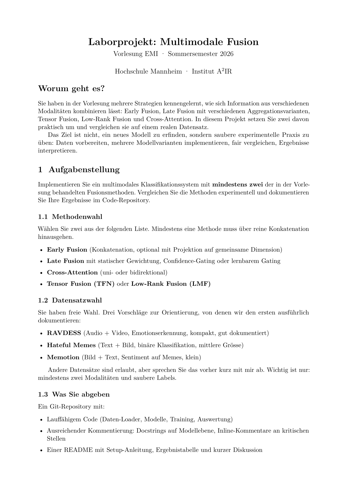
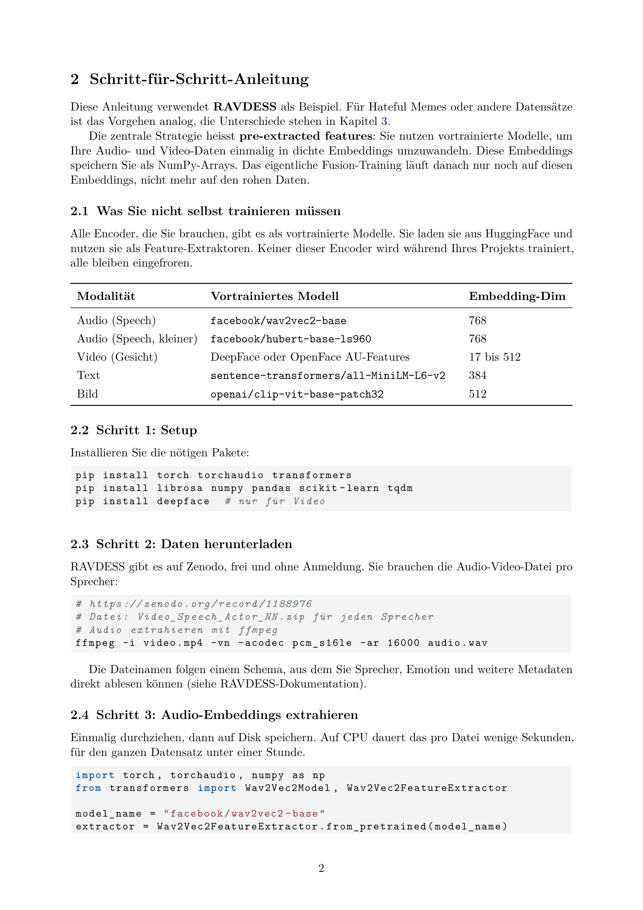
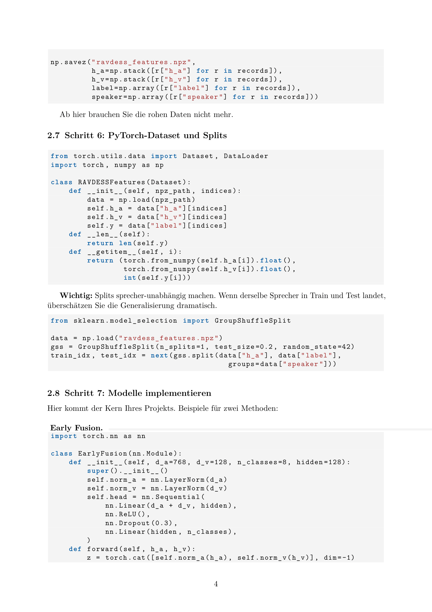
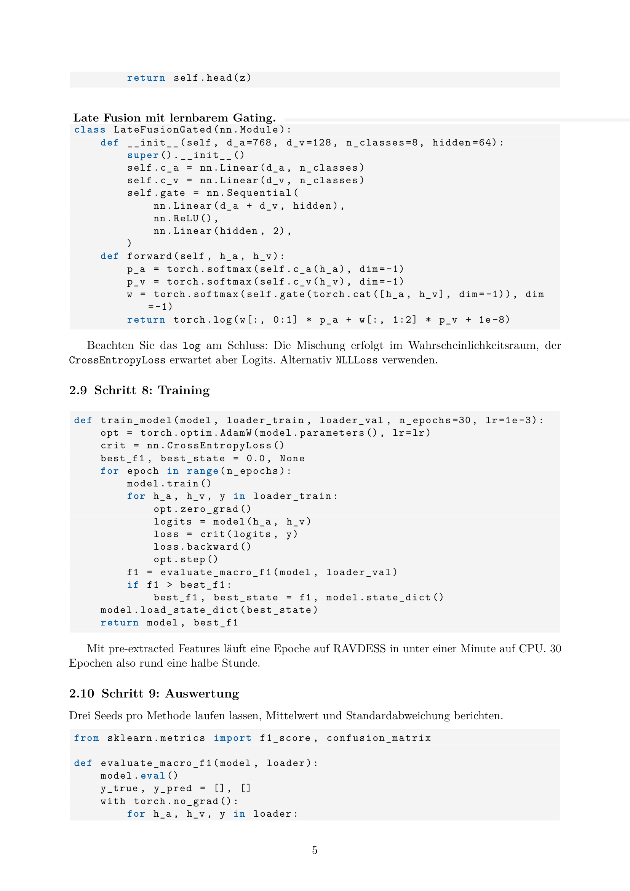
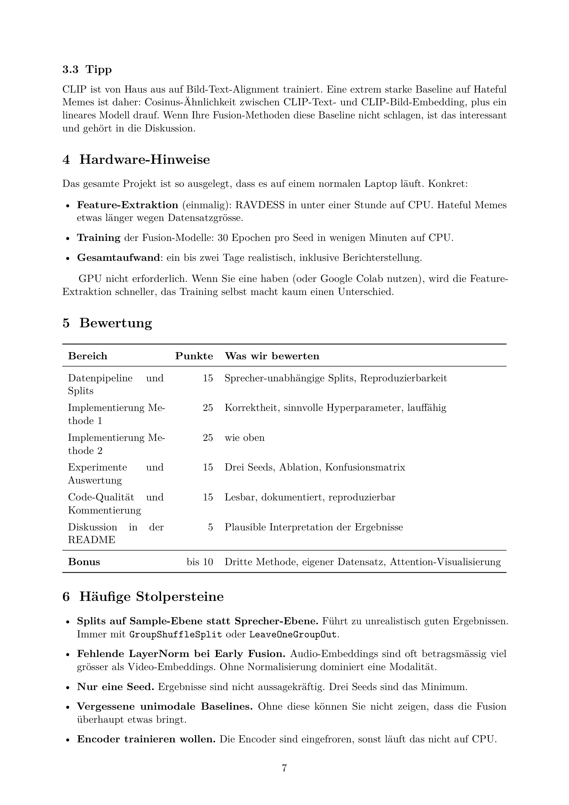
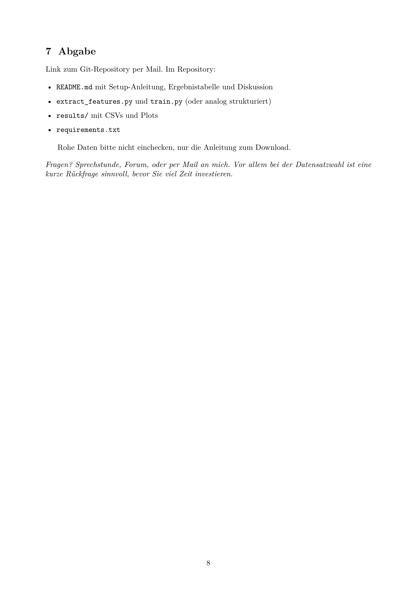

# EMI_Projekt

## Inhaltsverzeichnis
- [Setup](#setup)
- [Ergebnistabelle](#ergebnistabelle)
- [Diskussion](#diskussion)
- [Aufgabenstellung](#aufgabenstellung)
  - [Todo Liste](#todo-liste)
  - [Aufgabenstellung File](#aufgabenstellung-file)
- [Planung](#planung)
- [Shell Commands](#shell-commands)

## Setup
tbd 

## Ergebnistabelle
tbd

<table>
<tr>
    <th style="text-align:left;"> 
    -
    </th>
    <th style="text-align:left;">
    Cross-Attention
    </th>
    <th style="text-align:left;">
    Early Fusion
    </th>
</tr> 

<tr>
    <th style="text-align:left;"> 
    Ergebnisse
    </th>
    <th style="text-align:left;">
    Text 1
    </th>
    <th style="text-align:left;">
    Text 2
    </th>
</tr>

<tr>
    <th style="text-align:left;"> 
    Vorteile
    </th>
    <th style="text-align:left;">
    Text 3
    </th>
    <th style="text-align:left;">
    Text 4
    </th>
</tr>

<tr>
    <th style="text-align:left;"> 
    Nachteile
    </th>
    <th style="text-align:left;">
    Text 5
    </th>
    <th style="text-align:left;">
    Text 6
    </th>
</tr>

</table>

## Diskussion
tbd

## Aufgabenstellung

Implementieren Sie ein multimodales Klassifikationssystem mit mindestens zwei der in der Vorle-
sung behandelten Fusionsmethoden. Vergleichen Sie die Methoden experimentell und dokumentieren
Sie Ihre Ergebnisse im Code-Repository. \
Ausführlich in [Section File](#aufgabenstellung-file)

### Todo Liste
- [ ] Setup in Readme schreiben
- [ ] Ergebnistabelle in Readme schreiben
- [ ] Diskussion in Readme schreiben

### Aufgabenstellung File
















## Planung
````mermaid
---
config:
  theme: 'default'
---
classDiagram
    class ExtractFeatures{
    }
    
    class Train{
        
    }
    
    class main{
    }
    
    ExtractFeatures --> main
    Train --> main
````

## Shell Commands

````shell
pip install -r .\requirements.txt
````

````shell
# create virtual enviroment /.venv :
python3 -m venv .venv

#activate virtual enviroment:
source .venv/bin/activate
````